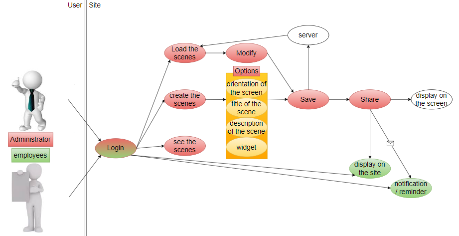

# Functional Specification

## Table of contents
- [Functional Specification](#functional-specification)
  - [Table of contents](#table-of-contents)
    - [1. Project role distribution](#1-project-role-distribution)
    - [2. Overview](#2-overview)
    - [3. Personas and scenario](#3-personas-and-scenario)
        - [a. Hervé](#a-hervé)
        - [b. Alan](#b-alan)
        - [c. Solange](#c-solange)
        - [d. Estelle](#d-estelle)
    - [4. Use case](#4-use-case)
    - [5. Risks and Assumptions](#5-risks-and-assumptions)
    - [6. Goals and non goals](#6-goals-and-non-goals)
    - [7. Development and environement and Requirements](#7-development-and-environement-and-requirements)
    - [8. Glossary](#8-glossary)

### 1. Project role distribution

| PERSON | ROLE |
| :-: | :-: |
| Nicolas MIDA | Project Manager |
| Grégory PAGNOUX | Program Manager |
| Rémy CHARLES | Tech Leader |
| Audrey Telliez | Software Engineer |
| Pierre GORIN | Quality Assurance |
  
### 2. Overview

Jacobi's[^1] company commissioned us to create a communication tool to centralize the information to be transmitted to all employees.

Currently, the company share and send the informations via different application like Team, Email or Yammer, but also with a paper display. However, these means of communication are too numerous and even outdated. The company would like to facilitate communication and make it more modern with the digital tools that exist.

Mr. Saeed, the Project owner of the company in France, would like a simple and secure communication tool to honor these two key points that Jacobi represents.

**Company distribution**

| PERSON | ROLE | DESCRIPTION |
| :-: | :-: | :-: |
| Mr. Remko GOUDAPPEL | CEO |  |
| Mr. Usman SAEED |  | Project owner |
| Mr. Pierre PAGE | HR Manager | Content creator |
| Ms. Karen BLANQUE | HR Assistant | Content creator |
| Mr. Nicolas YVELIN | Factory Manager | Content creator |
| Mr. Samuel NEVES | Maintenance Shop Manager | On-site installation manager |

### 3. Personas and scenario

##### a. Hervé

Hervé has been Jacobi's communications director for 10 years. He is a vigorous 52 year old man. He divorced his wife 3 years ago with whom he had two children, Jessica and Nathan.

He leaves Salbris, his home, and arrives at Jacobi for 7:15 am. He turns on the two screens in the factory and in the open space. Then he goes on his computer, on the administrator account of the site, then he chooses the "create" option and he sets each element of the scene (number of parts, widgets, text, image...) with the news of the day that his boss, Mr. Saeed, asked him to share with all the employees of the company the day before. Once the settings are complete, he saves the scene and shares it on both screens simultaneously.
Saving his scene will allow him to load it later if he wants to use it again and to modify it.
At 7:30 a.m., when all employees arrive at the plant, they can view the news directly.

##### b. Alan

Alan is 36 years old, she is engaged to Estelle and they have a daughter named Amelia. Alan and Estelle leave for work together after dropping their daughter off at her parents-in-law's house in Foëcy, a few blocks from their home.

He arrives at the factory at 7:20 a.m., and leaves for his office. Hervé, his superior, left on vacation the day before and gave him the mission to share the scenes he had already created. He uses the administrator account and chooses the "load" option to load the scene he has to share today on both screens simultaneously.

##### c. Solange

Solange is 42 years old and single. She lives in Vouzeron and has been working in Jacobi since those 20 years, after leaving her BTS communication.

She is Hervé’s right-hand man and yesterday he called her in an emergency. It has been three days since he went on vacation and there has been an amendment to the regulations regarding the plant employees. On the admin account, he asked her to share on the screen that is in the open-space, the scene already preparing by simply loading it, but by changing the image he had and she also corrected an error in the title that Hervé had committed. Then she had to create a new scene in which she would write the new company guidelines and regulations. Then she had to share this scene only on the screen that was in the factory.

##### d. Estelle

Estelle is 39 years old, she is engaged to Alan and they have a daughter named Amelia. Alan and Estelle leave for work together after dropping their daughter off at her parents' house in Foëcy, a few blocks from their home.

She arrives at the factory at 7:20 a.m., puts on her work clothes and goes in front of the screen to find out about possible news.
On her post, Estelle has a computer you can, if she wishes, have a return of the screens on the same site that Hervé used to create the scene, but with a simple employee account.

### 4. Use case

### 5. Risks and Assumptions

**the reglementation of data backups :**

There are three different archives depending on the type of data :
- Active database archiving where data that are no longer useful to the enterprise (for example, data on job seekers to which they have not followed up) are deleted once the reason for the study has been completed (after a maximum of two years).
- Intermediate archiving where data are saved even after the purpose of data collection has been achieved as they are still of interest to the enterprise. The duration is set by the person responsible and must be relevant to its usefulness.
- Final archiving where data that remains of great interest in the future without an end date are saved, after an upstream check.

source : [CNIL](https://www.cnil.fr/sites/default/files/atoms/files/guide_durees_de_conservation.pdf)[^2]

### 6. Goals and non goals

**Goals :**

- site very scure
- digitalise the communication
- make it easy to publish the content

**Non goals :**

- Do not use the screen for entertainment purposes

### 7. Development and environement and Requirements

  - HTML[^3]
  - CSS [^4]
  - JS [^5]
  - PHP [^6]
  - Windows/MacOS on development

---
### 8. Glossary

[^1]: Jacobi
It's an air and water purification solutions company. The company is based in Vierzon since 1956.

[^2]: CNIL (Comission National Informatique & Libertés)
It's an administrative authority that has existed since January 6, 1978, and ensures the proper use and security of computer data.

[^3]: HTML (HyperText Markup Language)
We use this language to create a web page. It is the skeleton of the page. We write all the content as well as its structure.

[^4]: CSS (Cascading Style Sheets)
This language completes HTML. It allows to format and make more ergonomic the website. It is the flesh that embellishes the skeleton.

[^5]: JS (JavaScript)
It's an object-oriented scripting language. This means that we can make the elements that make up the website dynamic. It is the muscles and joints of the site.

[^6]: PHP (Hypertext Prepositor)
It's a langage used for create dynamic web pages via HTTP server (server side) but also localy.
